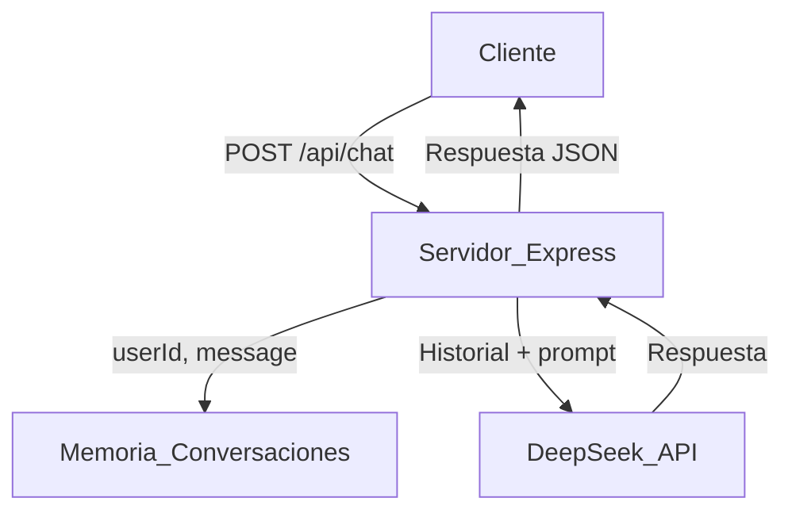

# Arquitectura del Proyecto deep-seek-service-chat

## Resumen General
Este proyecto es un servicio backend Node.js que expone una API REST para chat conversacional usando la API de DeepSeek. Permite gestionar múltiples conversaciones en paralelo, manteniendo el contexto en memoria para cada usuario.

## Estructura de Carpetas

```
deep-seek-service-chat/
├── server.js            # Lógica principal del servidor Express y API REST
├── package.json         # Dependencias y metadatos del proyecto
├── package-lock.json    # Versionado exacto de dependencias
├── promt_config.txt     # Prompt base para el sistema (rol system)
├── .env                 # Variables de entorno (no versionado, recomendado)
├── .gitignore           # Exclusiones de git
├── node_modules/        # Dependencias instaladas
└── documentacion/
    └── arquitectura.md  # (Este archivo)
```

## Dependencias Clave
- **express**: Framework web para Node.js, maneja rutas y servidor HTTP.
- **body-parser**: Middleware para parsear JSON en peticiones.
- **axios**: Cliente HTTP para consumir la API de DeepSeek.
- **dotenv**: Carga variables de entorno desde un archivo `.env`.

## Flujo de Funcionamiento
1. **Inicialización**: Se carga el prompt base desde `promt_config.txt` y se configuran las variables de entorno.
2. **API REST**: El endpoint principal es `POST /api/chat`, que recibe `userId` y `message`.
3. **Gestión de Conversaciones**: Se mantiene un historial en memoria (por usuario) para preservar el contexto conversacional.
4. **Llamada a DeepSeek**: Se envía el historial a la API de DeepSeek y se recibe la respuesta del modelo.
5. **Respuesta**: Se retorna la respuesta del asistente y se actualiza el historial.

## Variables de Entorno Sugeridas (`.env`)
```env
DEEPSEEK_API_KEY=tu_api_key
MAX_TOKENS=1024
PORT=3000
```

## Diagrama de Flujo


## Notas y Recomendaciones
- **Persistencia**: Actualmente el historial se almacena en memoria. Para producción, se recomienda usar una base de datos.
- **Seguridad**: No exponer la API Key en el código ni en repositorios públicos.
- **Escalabilidad**: El almacenamiento en memoria limita la escalabilidad horizontal.

---

> Para detalles adicionales, revisar `server.js` y la configuración en `package.json`. 